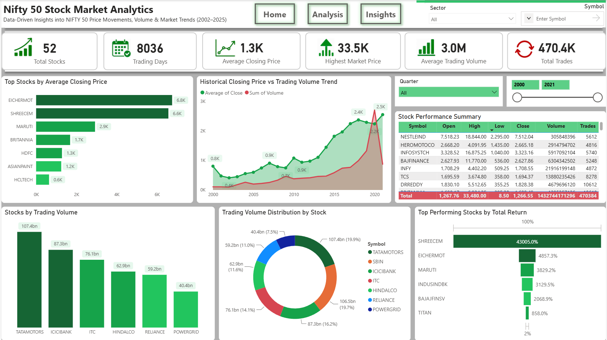
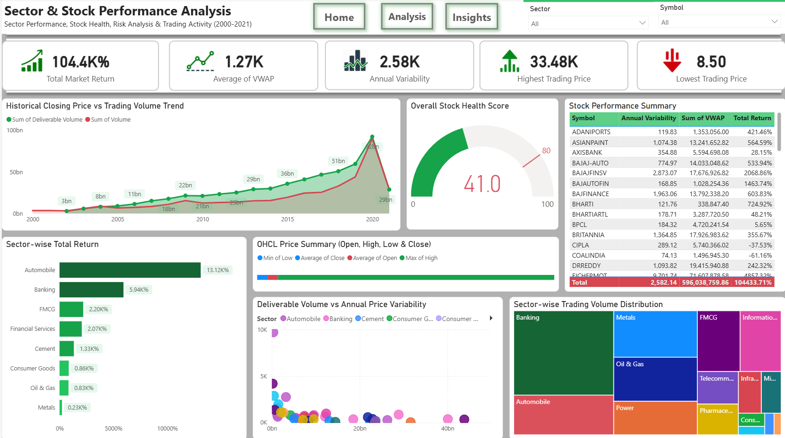
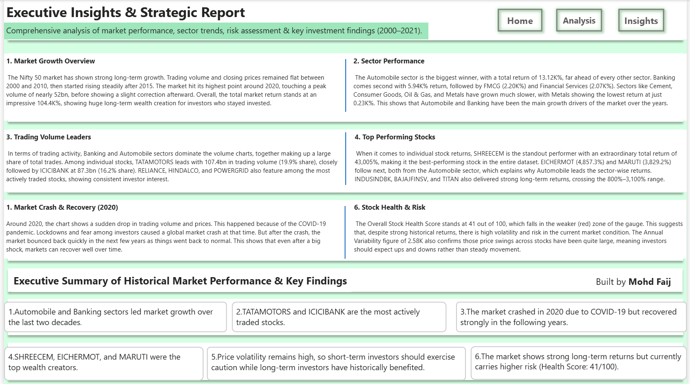

<div align="center">

# 📊 NIFTY 50 Stock Market Analytics
### Business Intelligence & Financial Analytics — End-to-End Project (2000–2021)

*20+ years of NIFTY 50 market data, transformed into an interactive dashboard, an executive report, and a live stock analytics platform.*

<br>

[](https://powerbi.microsoft.com/)
[](https://www.postgresql.org/)
[](https://www.python.org/)
[](https://learn.microsoft.com/en-us/dax/)
[](./LICENSE)

<br>

[](https://mohdfaij-data.github.io)
[](https://github.com/mohdfaij-data)
[](https://linkedin.com/in/mohdfaij-data)

</div>

<br>

---

## 📑 Table of Contents

- [Overview](#-overview)
- [Key Deliverables](#-key-deliverables)
- [Dashboard Preview](#️-dashboard-preview)
- [Key Insights](#-key-insights)
- [Tech Stack](#️-tech-stack)
- [Architecture](#-project-architecture)
- [Repository Structure](#-repository-structure)
- [What I Learned](#-what-i-learned)
- [Connect With Me](#-connect-with-me)

---

## 📌 Overview

This project turns **over two decades of NIFTY 50 market data** into a complete analytics ecosystem — covering **52 stocks**, **8,036 trading days**, and **470K+ trades**.

Instead of stopping at a single dashboard, this project was built as an **end-to-end BI system**:

> Raw market data → Cleaned & modeled data → Interactive dashboard → Executive report → Live stock screening platform

The result is a story that moves from *"what happened in the market"* to *"what should you actually do with that information."*

<div align="center">

| 📈 52 Stocks | 📅 8,036 Trading Days | 💹 470K+ Trades | 🚀 104.4K% Market Return |
|:---:|:---:|:---:|:---:|

</div>

---

## 🚀 Key Deliverables

### 1️⃣ Interactive Power BI Dashboard
A 3-page dashboard powered by advanced DAX measures, dynamic slicers, and drill-through interactivity.

| Page | Focus |
|---|---|
| **Home — Market Overview** | Total stocks, trading days, average closing price, historical volume trends |
| **Analysis — Sector & Stock Performance** | Sector-wise returns, OHLC summary, stock health score, risk & variability |
| **Insights — Executive Report** | Market crash & recovery, top performers, strategic takeaways |

### 2️⃣ Executive Analytics Report
A structured, stakeholder-ready report covering historical trends, sector performance, risk assessment, and key findings — built for decision-makers who need the full picture without opening Power BI.

### 3️⃣ StockIQ — Stock Screener & Analytics Platform *(actively evolving)*
A companion web platform to screen and analyze stocks using financial ratios and performance metrics, extending this project from static reporting into a live, interactive tool.

---

## 🖼️ Dashboard Preview

<table>
<tr>
<td width="100%">

### 🏠 Home — Market Overview
Total stocks, trading volume trends, top stocks by average closing price, and trading volume distribution across the NIFTY 50.



</td>
</tr>
<tr>
<td width="100%">

### 📊 Analysis — Sector & Stock Performance
Sector-wise total return, stock health score, OHLC price summary, and deliverable volume vs. annual variability.



</td>
</tr>
<tr>
<td width="100%">

### 🧠 Insights — Executive Strategic Report
Market growth overview, sector performance, top performing stocks, COVID-19 crash & recovery analysis, and strategic takeaways.



</td>
</tr>
</table>

---

## 💡 Key Insights

- 🚗 **Automobile** was the top-performing sector with a **13.12K% total return** — far ahead of Banking (5.94K%) and FMCG (2.20K%)
- 🏆 **SHREECEM** delivered an extraordinary **43,005% total return**, the highest of any stock in the dataset
- 📉 The market crashed sharply in **2020 due to COVID-19**, then recovered strongly — a clear case study in short-term volatility vs. long-term resilience
- ⚠️ An **Overall Stock Health Score of 41/100** signals continued volatility despite strong historical returns
- 📊 **TATAMOTORS** and **ICICIBANK** were the most actively traded stocks, together driving a major share of total market volume

---

## 🛠️ Tech Stack

<div align="center">

| Layer | Tools |
|---|---|
| **Visualization** | Power BI |
| **Data Modeling & ETL** | Power Query, Data Modeling |
| **Analytics Layer** | DAX (advanced measures & KPIs) |
| **Data Processing** | SQL, Python |
| **Reporting** | Executive Analytics Report |

</div>

---

## 🏗️ Project Architecture

```
                ┌─────────────────────┐
                │   Raw NIFTY 50 Data │
                │   (2000–2021)       │
                └──────────┬──────────┘
                           │
                 Python + SQL (Cleaning,
                 Transformation, Modeling)
                           │
                           ▼
                ┌─────────────────────┐
                │   Power Query +     │
                │   Data Model        │
                └──────────┬──────────┘
                           │
                    DAX Measures + KPIs
                           │
                           ▼
        ┌──────────────────────────────────┐
        │      Power BI Dashboard          │
        │  Home → Analysis → Insights      │
        └──────────────┬───────────────────┘
                        │
                        ▼
        ┌──────────────────────────────────┐
        │   Executive Report + StockIQ     │
        │   (Screener & Analytics Platform)│
        └──────────────────────────────────┘
```

---

## 📂 Repository Structure

```
📦 nifty50-stock-market-analytics
 ┣ 📂 assets
 ┃ ┗ 📂 images
 ┃   ┣ 🖼️ Home.png
 ┃   ┣ 🖼️ Analysiss.png
 ┃   ┗ 🖼️ Insightsreport.png
 ┣ 📂 data                → Raw & processed datasets
 ┣ 📂 dashboard           → Power BI (.pbix) file
 ┣ 📂 report              → Executive Analytics Report
 ┗ 📜 README.md
```

---

## 🧠 What I Learned

Building this project meant working across the full analytics pipeline — cleaning and modeling 20+ years of raw market data, writing DAX measures that hold up under real filtering conditions, and figuring out how to present risk and performance in a way a non-technical stakeholder could actually use.

The biggest takeaway: a dashboard is only as good as the story it tells. Numbers alone don't drive decisions — context does.

---

## 📬 Connect With Me

<div align="center">

### **Mohd Faij**
*Data Analyst | Business Intelligence Enthusiast*

[](https://mohdfaij-data.github.io)
[](https://github.com/mohdfaij-data)
[](https://linkedin.com/in/mohdfaij-data)

<br>

⭐ **If you found this project useful, consider giving it a star — it genuinely helps!**

</div>
